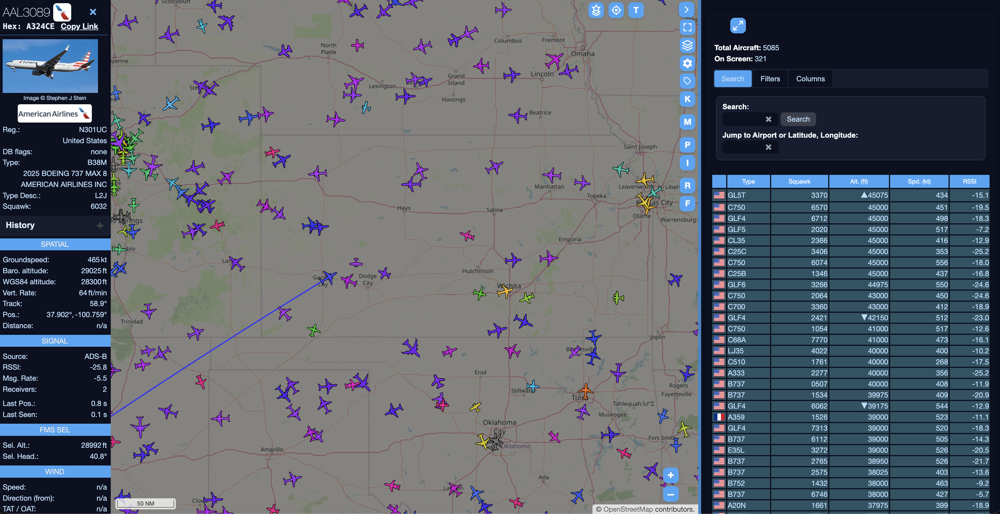

# retar

An extremely fast, high-performance UI for ADS-B data visualization, designed for use with **dump1090** and **readsb**.

This is a **detached fork of wiedehopf's tar1090**. While the original tar1090 provides a powerful engine, its interface is a legacy UI that often feels like it was designed in the early 2000s.

This fork cleans up the user experience under the name **retar**. It provides a cleaner look and feel.




###  [Documentation Hub (docs/)](docs/README.md)
*   **[Configuration Guide](docs/CONFIG.md)**: Configuring retar.
*   **[User Guide](docs/USER_GUIDE.md)**: How to use the map, filters, and UI features.

---


## Installation

```
sudo bash -c "$(wget -nv -O - https://github.com/Jxck-S/retar/raw/master/install.sh)"
```

## View the added webinterface

Click the following URL and replace the IP address of your instance:

http://[IP_ADDRESS]/tar1090

If you are curious about your coverage, try this URL:

http://[IP_ADDRESS]/?pTracks

Check further down for keyboard shortcuts.

## Update (same command as installation)

```
sudo bash -c "$(wget -nv -O - https://github.com/Jxck-S/retar/raw/master/install.sh)"
```

Configuration should be preserved.


## UI Guide

For user interface details such as filters, keyboard shortcuts, and URL parameters, please see the **[User Guide](docs/USER_GUIDE.md)**.


## Remove / Uninstall

```
sudo bash -c "$(wget -nv -O - https://github.com/Jxck-S/retar/raw/master/uninstall.sh)"
```

